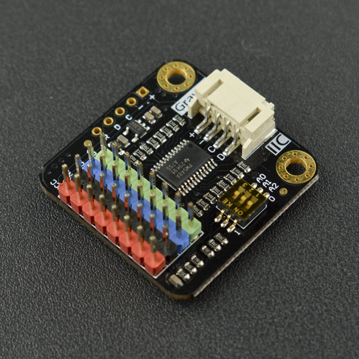

# DFRobot_I2C_Multiplexer

- [中文版](./README_CN.md)

On the same I2C port, DFRobot Gravity: I2C Multiplexer solves the address conflict and enables the normal communication with multiple same-address I2C devices.



## Product Link(https://www.dfrobot.com/product-1780.html)

SKU: DFR0576

## Table of Contents

* [Summary](#summary)
* [Installation](#installation)
* [Methods](#methods)
* [Compatibility](#compatibility)
* [History](#history)
* [Credits](#credits)

## Summary

This library is for the Gravity: Digital 1-to-8 I2C Multiplexer.

## Installation

To use this library download the zip file, uncompress it to a folder named DFRobot_I2C_Multiplexer.
Download the zip file first to use this library and uncompress it to a folder named DFRobot_I2C_Multiplexer.

## Methods

```C++

  /**
   * @fn scan
   * @brief Scan all I2C devices connected to the I2C cascade module
   * @param port  Specify the port for scanning
   * @return uint8_t*  Return the I2C address of all devices
   */
  uint8_t *scan(uint8_t port);

  /**
   * @fn selectPort
   * @brief Specify the port of the I2C cascade module
   * @param port   Select port
   */
  void selectPort(uint8_t port);

  /**
   * @fn read
   * @brief  Read the data of the target I2C device 
   * @param port  The I2C port that the target device is connected to
   * @param addr  I2C address of the target device
   * @param reg   Register of the target device to be read
   * @param data  Data of the target device to be stored
   * @param len   Data length of the target device to be read
   * @return uint8_t read status
   */
  uint8_t read(uint8_t port,uint8_t addr,uint8_t reg,uint8_t* data, uint8_t len);

  /**
   * @fn write
   * @brief   Write the data into the target I2C device 
   * @param port   The I2C port that the target device is connected to
   * @param addr   I2C address of the target device
   * @param reg    Register of the target device to be written
   * @param buf    Data of the target device to be written
   * @param len    Data length of the target device to be written
   */
  void write(uint8_t port,uint8_t addr, uint8_t reg,uint8_t* buf, uint8_t len);

```
## Compatibility

MCU                | Work Well | Work Wrong | Untested  | Remarks
------------------ | :----------: | :----------: | :---------: | -----
FireBeetle-ESP32  |      √       |             |            | 
FireBeetle-ESP8266|      √       |              |             | 
Mega2560  |      √       |             |            | 
Arduino UNO |       √      |             |            | 
Leonardo  |      √       |              |             | 
micro:bit  |      √       |              |             | 
M0  |      √       |              |             | 

## History

- 2022/3/23 - 1.0.1 Version

## Credits

Written by PengKaixing(kaixing.peng@dfrobot.com), 2021. (Welcome to our [website](https://www.dfrobot.com/))
